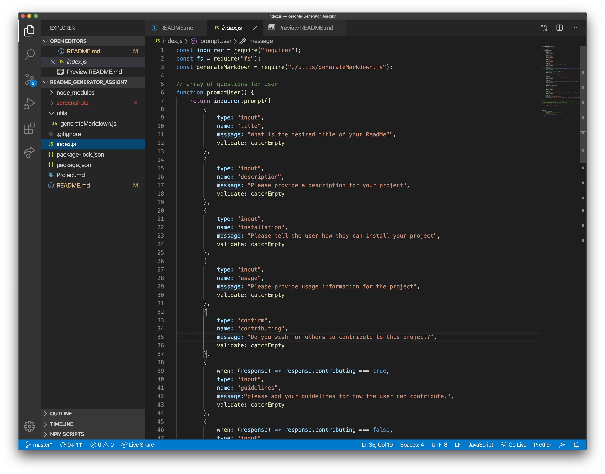
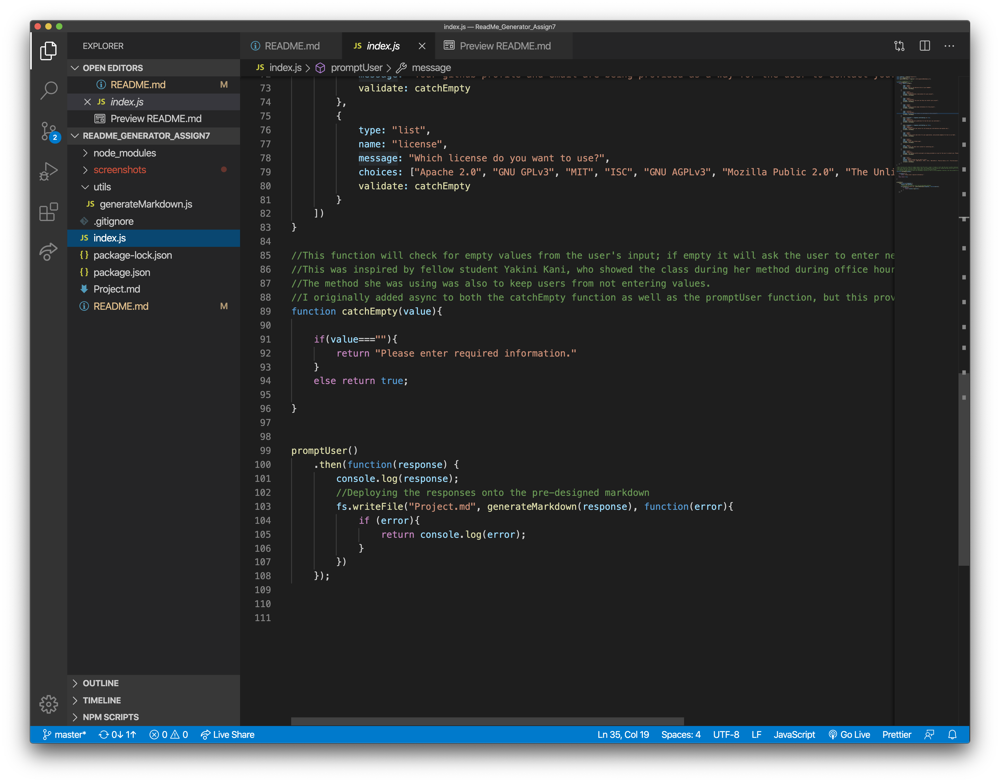
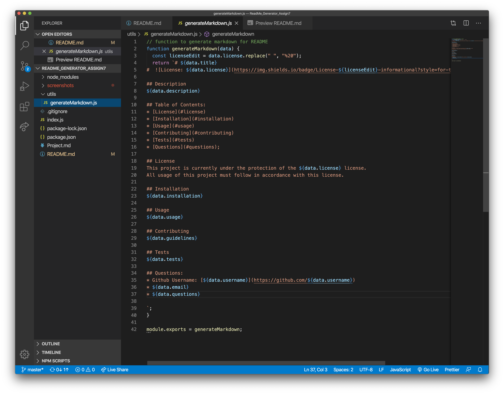
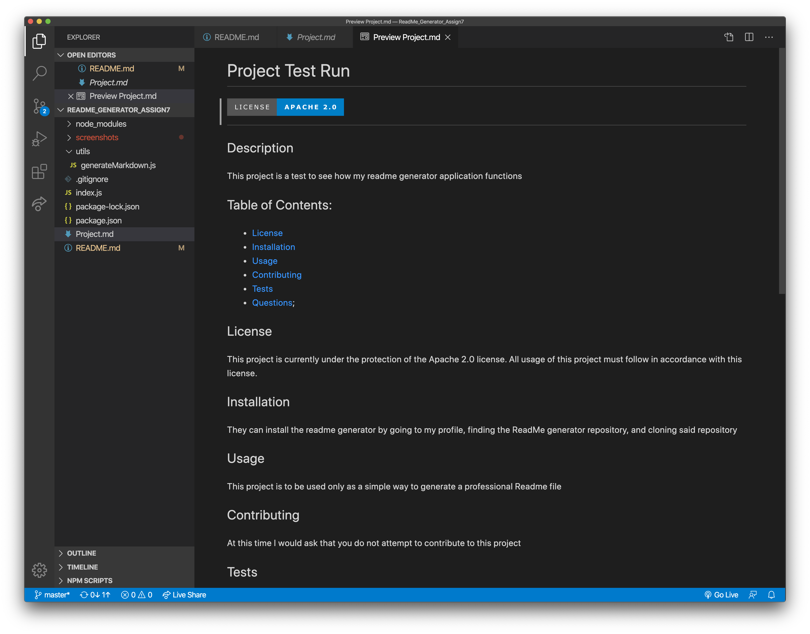

# ReadMe_Generator_Assign7

# Description:
This project takes node.js, javascript and inquirer npm and makes a ReadMe generator. The user will access it via the command line, fill out the required questions, and then they will be presented with a polished, professional Readme for their desired project. This readme will be listed as Project.md

# Table of Contents:
1. [Description](#Description)
2. [Purpose](#Purpose)
3. [Process](#Process)
4. [Issues](#Issues)
5. [What I Learned](#What)
6. [Video](#Video)
7. [Link](#Link)
8. [Screenshot](#Screenshot)

# Purpose
The purpose of this assignment is to create a readme generator that will build a polished readme.md based off of the user's input. I built this project to apply my newfound knowledge in node.js, javascript, and in the usage of npms. 

# Process
* First I began by installing inquirer onto my application. 
* Then I went to generateMarkdown.js and built the layout of the readMe that would be deployed once the user put in the required info. 
* From there I went into index.js and built an object that would contain the question types and messages that the user would see. In order to make it work I needed to make sure that it was built inside a function that would prompt inquirer npm to run. I required fs and inquirer to run in order for any further work to go forward. 
* After successfully testing to make sure that the questions were being deployed into the command line, I then linked the generateMarkdown.js to the index.js by require so that I could use fs.writeFile to fill in the necesscary spaces of the readMe that the user was attempting to create.
* To improve upon this application, I went and made a function in index.js that would check if the value of the user's input on a given question was empty. If it was, the program would bring back the question and require that the user fill it out. This way, there would be no sections left unanswered within the readMe, as this would create an unprofessional design. 

# Issues I Encountered
* When to make something asynchronous. When I attempted to make the function that would check to see if the user's input was empty, I thought I needed to make the promptUser function async and have the prompt await the other function. While this did work, it made it so that the user's input couldn't be deployed. In order to fix this I simply needed to return the prompt and get rid of the async function.
* Another issue I had was troubleshooting problems that would occur on the command line. This is due to a lack of experience working within the command line. In order to improve I will need to get a better understanding of what errors like unhandled promise rejection mean.

# What I Learned
* How to create a package.json via npm init
* How to install the different packages into the application
* How to create a secondary javascript file that can be called upon by require in the primary javascript
* How to use npm's like inquirer
* How to write and edit files via fs 

# Video Demo 

* If you wish to go back and see specific steps of the demo, feel free to click the link below and download the video demo
* [Video Demo](https://drive.google.com/file/d/1PACj9ry5yPoZBYQ0SLAjmoVkK7SQglGO/view?usp=sharing)
# Link

# Screenshot

